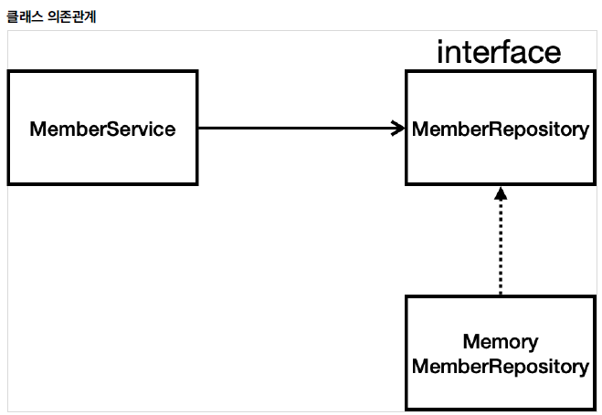

# 2. 회원 관리 예제 - 백엔드 개발

---

## 1. 비즈니스 요구사항 정리
+ 데이터: 회원ID, 이름
+ 기능: 회원등록, 조회
+ 아직 데이터 저장소가 선정되지 않음(가상의 시나리오)

**일반적인 웹 애플리케이션 계층 구조**


+ 컨트롤러: 웹MVC의 컨트롤러 역할
+ 서비스: 핵심 비즈니스 로직 구현
+ 리포지토리: 데이터베이스에 접근, 도메인 객체를 DB에 저장하고 관리
+ 도메인: 비즈니스 도메인 객체 ex)회원, 주문, 쿠폰 등 주로 데이터 베이스에 저장하고 관리됨

**클래스 의존 관계**



+ 아직 데이터 저장소가 선정되지 않았다는 가정
+ MemberRepository interface로 설계

---

## 2. 회원 도메인과 리포지토리 만들기

domain/Member
```java
public class Member {

    private Long id;
    private String name;

    public Long getId() {
        return id;
    }

    public void setId(Long id) {
        this.id = id;
    }

    public String getName() {
        return name;
    }

    public void setName(String name) {
        this.name = name;
    }
}
```

repository/MemberRepository
```java
public interface MemberRepository {
    Member save(Member member);
    Optional<Member> findById(Long id);
    Optional<Member> findByName(String name);
    List<Member> findAll();
}
```

repository/MemoryMemberRepository
```java
public class MemoryMemberRepository implements MemberRepository{
    //메모리에서 저장하기 위한 Map
    private static Map<Long,Member> store = new HashMap<>();

    //store에 저장될 key
    private static long sequence = 0l;


    @Override
    public Member save(Member member) {
        member.setId(++sequence);
        store.put(member.getId(),member);
        return member;
    }

    @Override
    public Optional<Member> findById(Long id) {
        //반환값이 null일 경우를 대비해서 Optional로 감싼다.
        //null이면 빈 Optinal 객체를 반환한다.
        return Optional.ofNullable(store.get(id));
    }

    @Override
    public Optional<Member> findByName(String name) {
        return store.values().stream()
                .filter(member -> member.getName().equals(name))
                .findAny();
    }

    @Override
    public List<Member> findAll() {
        return new ArrayList<>(store.values());
    }

    public void clearStore(){
        store.clear();

    }
}
```

---

## 3. 회원 리포지토리 테스트 케이스 작성

개발한 기능을 테스트 할 때 main메서드나 컨트롤러를 통해 실행하면 오래 걸리고 반복 실행하기 번거롭다

JUnit 프레임워크로 테스트

**회원 리포지토리 메모리 구현체 테스트**
```java
public class MemoryMemberRepositoryTest {

    MemoryMemberRepository repository = new MemoryMemberRepository();

    @AfterEach
    public void afterEach(){
        repository.clearStore();
    }

    @Test
    public void save(){
        Member member = new Member();
        member.setName("spring");

        repository.save(member);

        Member result = repository.findById(member.getId()).get();
        assertThat(member).isEqualTo(result);
    }

    @Test
    public void findByName(){
        Member member1 = new Member();
        member1.setName("spring1");
        repository.save(member1);

        Member member2 = new Member();
        member2.setName("spring2");
        repository.save(member2);

        Member result = repository.findByName("spring1").get();

        assertThat(result).isEqualTo(member1);
    }

    @Test
    public void findAll(){
        Member member1 = new Member();
        member1.setName("spring1");
        repository.save(member1);


        Member member2 = new Member();
        member2.setName("spring2");
        repository.save(member2);

        List<Member> result = repository.findAll();

        assertThat(result.size()).isEqualTo(2);
    }
}
```

## 4. 회원 서비스 개발

서비스 - 회원 리포지토리와 도메인을 활용해서 비즈니스 로직 작성
service/MemberService
```java
public class MemberService {

    private final MemberRepository memberRepository;

    /**
     * DI(Dependency Injection)
     * 의존관계 주입
     */
    public MemberService(MemberRepository memberRepository) {
        this.memberRepository = memberRepository;
    }

    /**
     * 회원 가입
     */
    public Long join(Member member) {
//
//        Optional<Member> result = memberRepository.findByName(member.getName());
//        result.ifPresent(m -> {
//            throw new IllegalStateException("이미 존재하는 회원입니다.");
//        });
//
        //같은 이름이 있는 중복 회원X
        validateDuplicateMember(member); //중복 회원 검증

        memberRepository.save(member);
        return member.getId();
    }

    private void validateDuplicateMember(Member member) {
        //값이 존재하면 throw
        memberRepository.findByName(member.getName())
                .ifPresent(m -> {
                    throw new IllegalStateException("이미 존재하는 회원입니다.");
                });
    }


    /**
     * 전체 회원 조회
     */
    public List<Member> findMembers(){
        return memberRepository.findAll();
    }

    public Optional<Member> findOne(Long memberId){
        return memberRepository.findById(memberId);
    }
}
```

---

## 5. 회원 서비스 테스트

```java
class MemberServiceTest {

    MemberService memberService;
    MemoryMemberRepository memberRepository;

    @BeforeEach
    public void beforeEach(){
        memberRepository = new MemoryMemberRepository();
        memberService = new MemberService(memberRepository);

    }

    @AfterEach
    public void afterEach(){
        memberRepository.clearStore();
    }

    @Test
    void 회원가입() {
        //given
        Member member = new Member();
        member.setName("hello");

        //when
        Long saveId = memberService.join(member);

        //then
        Member findMember = memberService.findOne(saveId).get();
        assertThat(member.getName()).isEqualTo(findMember.getName());
    }

    @Test
    public void 중복_회원_예외(){
        //given
        Member member1 = new Member();
        member1.setName("spring");

        Member member2 = new Member();
        member2.setName("spring");

        //when
        memberService.join(member1);
        IllegalStateException e = assertThrows(IllegalStateException.class, () -> memberService.join(member2));

        //then
        assertThat(e.getMessage()).isEqualTo("이미 존재하는 회원입니다.");

/*        try {
            memberService.join(member2);
            fail();
        }catch (IllegalStateException e){
            assertThat(e.getMessage()).isEqualTo("이미 존재하는 회원입니다.");
        }
        */

        
    }
    
}
```
