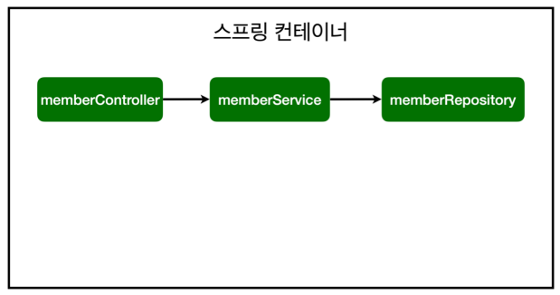

# 3. 스프링 빈과 의존관계

---

## 1. 스프링 빈과 의존관계
+ 스프링 빈을 등록하고, 의존관계 설정하기

멤버 컨트롤러가 멤버 서비스를 의존하게 만들어야함


controller/MemberService

@Controller Annotation이 있으면 Container에 MemberController 객체를 생성해서 관리
```java
@Controller
public class MemberController {
     @Autowired
    public MemberController(MemberService memberService) {
        this.memberService = memberService;
    }
}
```

+ Consider defining a bean of type 'hello.hellospring.service.MemberService' in your configuration.
    + MemberService가 스프링 빈으로 등록되어 있지 않음
    + MemberService에 @Service를 적어주어야 스프링이 container에 등록해줌

service/MemberService

```java
@Service
public class MemberService {

    private final MemberRepository memberRepository;

    public MemberService(MemberRepository memberRepository) {
        this.memberRepository = memberRepository;
    }
    //...
}
```

repository/MemoryMemberRepository

repository도 마찬가지로 @Repository 등록
```java
@Repository
public class MemoryMemberRepository implements MemberRepository {

    //메모리에서 저장하기 위한 Map
    private static Map<Long, Member> store = new HashMap<>();

    //store에 저장될 key
    private static long sequence = 0l;
    
    //...
}
```

**스프링 빈 등록 이미지**



Controller - Service 연결 (Autowired)
 + Controller가 생성될 때 스프링 빈에 등록되어 있는 MemberService 객체를 가져다 넣어줌 --> DI

```java
@Controller
public class MemberController {

    private final MemberService memberService;
    
    @Autowired
    public MemberController(MemberService memberService) {
        this.memberService = memberService;
    }
}
```

MemberService는 memberRepository가 필요
+ Autowired가 되어있으면 MemberService를 스프링이 생성할 때 컨테이너에 등록하면서 생성자 호출
+ 컨테이너에 있는 MemberRepository를 Service에 주입

```java
@Service
public class MemberService {

  private final MemberRepository memberRepository;

  @Autowired
  public MemberService(MemberRepository memberRepository) {
    this.memberRepository = memberRepository;
  }
  //...
}
```

**스프링 빈을 등록하는 2가지 방법**

+ 컴포넌트 스캔과 자동 의존관계 설정
  + @Controller, @Service, @Repository (컴포넌트 스캔 방식 Service,Controller,Repository안에 Component Annotation이 붙어있음)
  + 스프링이 Component 관련된 애노테이션이 있으면 스프링 빈으로 자동 등록


+ 자바 코드로 직접 스프링 빈 등록하기

SpringConfig

```java
@Configuration
public class SpringConfig {

    @Bean
    public MemberService memberService(){
        return new MemberService(memberRepository());
    }
    @Bean
    public MemberRepository memberRepository(){
        return new MemoryMemberRepository();
    }
}
```

스프링 빈 직접 등록

+ DI는 필드 주입, setter주입, **생성자 주입** 3가지 방법이 있다.
+ 실무에서는 주로 컨트롤러, 서비스, 리포지토리 같은 코드는 컴포넌트 스캔을 사용한다.
+ 정형화되지 않거나, 상황에 따라 구현 클래스를 변경해야 하면 설정을 통해 스프링 빈으로 등록한다.
+ @Autowired를 통한 DI는 스프링이 관리하는 객체에서만 동작한다.