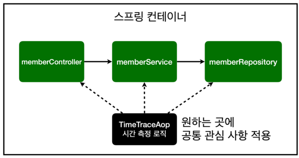

# 6. AOP

---

AOP: Aspect Oriented Programming

## 1. AOP가 필요한 상황
+ 모든 메서드의 호출 시간을 측정하고 싶을 때
+ 공통 관심 사항(cross-cutting concern) Vs 핵심 관심 사항(core concern)
+ 회원 가입 시간, 회원 조회 시간 측정

service/MemberService

시간 측정 기능 추가

```java
@Transactional
public class MemberService {

    private final MemberRepository memberRepository;

    public MemberService(MemberRepository memberRepository) {
        this.memberRepository = memberRepository;
    }

    /**
     * 회원 가입
     */
    public Long join(Member member) {
//
//        Optional<Member> result = memberRepository.findByName(member.getName());
//        result.ifPresent(m -> {
//            throw new IllegalStateException("이미 존재하는 회원입니다.");
//        });
//
        //같은 이름이 있는 중복 회원X

        long start = System.currentTimeMillis();
        try {
            validateDuplicateMember(member); //중복 회원 검증

            memberRepository.save(member);
            return member.getId();
        } finally {
            long finish = System.currentTimeMillis();
            long timeMs = finish - start;
            System.out.println("join " + timeMs + "ms");
        }
    }

    private void validateDuplicateMember(Member member) {
        //값이 존재하면 throw
        memberRepository.findByName(member.getName())
                .ifPresent(m -> {
                    throw new IllegalStateException("이미 존재하는 회원입니다.");
                });
    }


    /**
     * 전체 회원 조회
     */
    public List<Member> findMembers() {

        long start = System.currentTimeMillis();

        try {
            return memberRepository.findAll();
        } finally {
            long finish = System.currentTimeMillis();
            long timeMs = finish - start;
            System.out.println("findMembers " + timeMs + "ms");
        }
    }
}
```

문제점
+ 시간 측정 기능은 핵심 관심 사항이 아님
+ 시간 측정 로직은 공통 관심 사항
+ 핵심 비즈니스의 로직이 섞여서 유지보수가 어렵다
+ 시간 측정 로직을 별도의 공통 로직으로 만들기 매우 어렵다
+ 로직이 변경되면 모든 로직을 찾아가서 변경해야 함

---

## 2. AOP 적용




시간 측정 AOP 등록
aop/TimeTraceAop

```java
@Aspect
@Component
public class TimeTraceAop {

    @Around("execution(* hello.hellospring..*(..))")
    public Object execute(ProceedingJoinPoint joinPoint) throws Throwable{
        long start = System.currentTimeMillis();

        System.out.println("START: " + joinPoint.toString());

        try{
            return joinPoint.proceed();
        }finally{
            long finish = System.currentTimeMillis();
            long timeMs = finish - start;

            System.out.println("END: " + joinPoint.toString() + " " + timeMs + "ms");
        }

    }
}
```
MemberService의 시간측정 로직 제거


해결
+ 회원가입, 조회등 시간을 측정하는 공통 관심 사항을 분리
+ 시간을 측정하는 로직을 별도의 공통 로직으로 만들어 둠
+ 변경이 필요하면 이 로직만 변경하면 됨
+ 원하는 적용 대상을 선택 가능